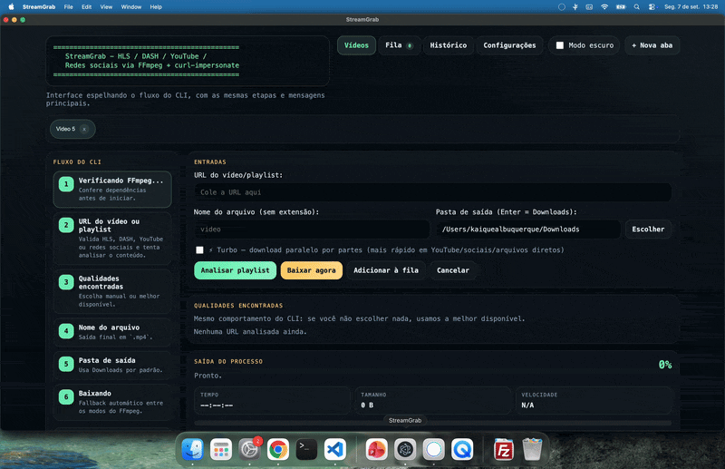
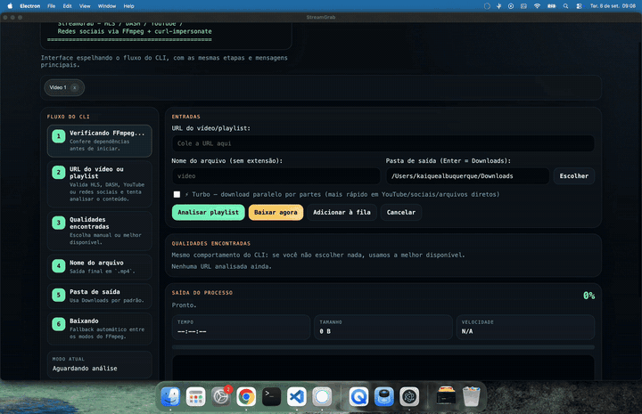

<div align="center">

# StreamGrab

**Download videos from HLS, DASH, YouTube, and other supported sources.**

</div>

---

### 📸 Demo

<!-- Record your screen with Kap (macOS) or ScreenToGif (Windows), then save the GIFs in assets/. -->
<!-- Recommendations: 8-10 FPS, 800px width, up to 10 MB per GIF, 10-15 seconds max. -->

#### Electron app usage for HLS downloads



#### Electron app usage for YouTube and social media



---


## The story

I bought a course I really liked. The problem? My access was about to expire. To keep watching, I'd have to buy it again — and in Brazil, that's expensive. One of the highest-taxed countries in the world, with little to show for it.

So I thought: *"there HAS to be a way to download these videos"*. Even if the platform doesn't offer it, there must be a way. And if there wasn't, I'd build one.

I started digging, learned about `m3u8`, curl-impersonate, yt-dlp, and put together a tool. Today I download the course videos, upload them to my personal cloud, and watch **whenever and wherever I want**, no strings attached.

And the best part: it works for way more than just courses — YouTube, Instagram, Facebook, TikTok, any streaming platform. If the video exists and you have access, StreamGrab handles it.

## How I download videos (step by step)

1. I open the video in the browser and hit **play** to make sure it's loading
2. Press **F12** to open DevTools (browser developer tools)
3. Go to the **Network** tab and type `m3u8` in the filter (or `media` — it varies by platform)
4. Click the video so it shows up in DevTools
5. Right-click the request → **Copy → Copy request URL**
6. Paste it into StreamGrab and hit Enter
7. Choose the quality and done — the video downloads!

> 💡 **Tip:** if you get a 403 error, the token probably expired. Go back to DevTools and copy again. Tokens are short-lived.

### What about YouTube / social media?

For YouTube, Instagram, Facebook, TikTok, and any social platform, it's **even simpler**: just copy the regular video link and paste it into StreamGrab. It detects the platform automatically via the yt-dlp engine.

```powershell
npm run download:youtube   # paste a YouTube link
node src/index.js          # paste any other link (Instagram, Facebook, etc.)
```

### And the cloud?

After downloading, just upload the `.mp4` to your personal cloud (Google Drive, OneDrive, pCloud, whatever you prefer) and watch from any device. Free forever. 🎉

---

### Requirements

- **Node.js 20+** — [nodejs.org](https://nodejs.org)
- **Windows 10/11** (also works on macOS/Linux, but automatic FFmpeg installation is Windows-only)
- **FFmpeg** — downloaded **automatically** by `npm install` (into `vendor/ffmpeg/`). Alternatively, install it manually and add it to your PATH.

> 💡 `npm install` runs a script (`postinstall`) that downloads the *essentials* build of FFmpeg (gyan.dev) and installs it locally into `vendor/ffmpeg/`. The program uses the local binary if it exists; otherwise it uses `ffmpeg` from the PATH. To install/update manually: `npm run ffmpeg:install`.

---

### Installation

```powershell
cd streamgrab
npm install
```

> Core HLS/DASH downloads can run directly with `node src/index.js` if Node.js and FFmpeg are available. Run `npm install` to install the packaged CLI, Electron tooling, optional `ntl` script menu, and the `youtube-dl-exec` dependency used for YouTube and social-site downloads.

### Install from npm

StreamGrab is also available as an npm package. Install the CLI globally:

```bash
npm install --global streamgrab
```

After installation, run it from any directory:

```bash
streamgrab <url>                                      # interactive download
streamgrab analyze <url> [--json]                     # analyze a URL
streamgrab download <url> [--output <dir>] [--turbo]  # download without prompts
streamgrab help                                       # show all commands
```

To update or remove the global installation:

```bash
npm update --global streamgrab
npm uninstall --global streamgrab
```

### Docker CLI

For technical users who want a reproducible CLI environment, StreamGrab can run in Docker with Node.js and FFmpeg already inside the image. This does not run the Electron desktop app; it is only for the command-line workflow.

```bash
docker-compose build
docker-compose run --rm streamgrab analyze "https://example.com/video.m3u8"
docker-compose run --rm streamgrab download "https://example.com/video.m3u8" --filename video
```

Downloads are written to `./downloads` on your machine, mounted as `/downloads` inside the container. The image sets `STREAMGRAB_DOWNLOAD_DIR=/downloads`, so `--output /downloads` is optional unless you want a different folder.

If a site requires cookies, export them to a Netscape `cookies.txt` file and mount it explicitly:

```yaml
services:
  streamgrab:
    volumes:
      - ./downloads:/downloads
      - ./cookies.txt:/cookies.txt:ro
```

Then run:

```bash
docker-compose run --rm streamgrab download "URL" --cookies /cookies.txt
```

Docker improves reproducibility, but it is not a permanent 15-year guarantee by itself. For long-term preservation, keep the `Dockerfile`, `package-lock.json`, release artifacts, and preferably publish/version the built image, because base images and registries can change or disappear over time.

---

### How to run

**Recommended (bypasses CDNs that block non-browser clients, like Midia Stream):**

```powershell
npm run download:curl
```

Basic (interactive flow):

```powershell
node src/index.js
```

Or use the `streamgrab` binary (available on PATH when installed via npm) with subcommands:

```powershell
streamgrab <url>                      # interactive (compatibility)
streamgrab analyze <url> [--json]     # non-interactive URL analysis
streamgrab download <url> [--output <dir>] [--turbo] [--chunks <n>]  # non-interactive download
streamgrab help                       # subcommand help
```

#### Full usage example

```
==============================================
   StreamGrab — HLS / DASH / YouTube / Social
==============================================

Checking FFmpeg...
FFmpeg OK.

.m3u8 URL: https://example.com/lesson/playlist.m3u8?cP=1997000&access_token=abc&sid=xyz
Recognized URL: https://example.com/lesson/playlist.m3u8?cP=1997000&access_token=***&sid=***

Parsing playlist...

Available qualities:
  1. 1920x1080 (1080p)  ~1.75 Mbps
  2. 1280x720 (720p)  ~0.90 Mbps
  3. 854x480 (480p)  ~0.50 Mbps
  4. 640x360 (360p)  ~0.30 Mbps
  5. 426x240 (240p)  ~0.15 Mbps
  0. Cancel

Choose (Enter = best available): 2
Selected variant: https://example.com/lesson/720p/index.m3u8?access_token=***

File name (without extension): Lesson 01
Output folder (Enter = C:\Users\YourUser\Downloads):
Saving to: C:\Users\YourUser\Downloads\Lesson 01.mp4

Downloading — mode: direct copy (-c copy)
Downloading...  Time: 00:12:43  Size: 184.0 MB  Speed: 6.2x
✅ Download complete!
File saved at: C:\Users\YourUser\Downloads\Lesson 01.mp4
```

#### Command-line arguments

```powershell
node src/index.js --referer "https://example.com/" --origin "https://example.com" --user-agent "Mozilla/5.0 ..."
```

- `--referer <URL>` — sends the `Referer` header
- `--origin <URL>` — sends the `Origin` header
- `--user-agent "<UA>"` — sends the `User-Agent` header
- `--curl-impersonate` / `--ci` — forces curl-impersonate mode
- `--cookies <file>` — uses a `cookies.txt` (Netscape format) for authenticated content (private YouTube, social networks with login)
- `--cookies-from-browser <browser>` — extracts cookies automatically from the browser (`chrome`, `edge`, `firefox`, `brave`, `opera`, `vivaldi`, `chromium`...)
- `--turbo` — parallel chunked download (HTTP Range) on direct URLs (YouTube/social networks/files). Faster: multiple connections at once
- `--chunks <n>` — number of turbo connections (default: 8)
- `--smart-turbo` / `--no-smart-turbo` — enables/disables Smart Turbo (adaptive concurrency)
- `--youtube` — forces the YouTube adapter (used by `npm run download:youtube`)
- `--help` — shows help

The same headers can be set in a `config.json` file in the project folder (see `config.example.json`). Values given on the command line take priority over the file.

---

### 🔐 Private / authenticated content

StreamGrab can download **private or restricted videos** only when you already have authenticated access. It uses your session cookies for sources such as unlisted/private YouTube videos or restricted Facebook/Instagram posts.

1. **Export cookies** from your browser while logged in:
   - Install **"Get cookies.txt LOCALLY"** for Chrome, Edge, or Firefox.
   - Open the video page, click the extension, and export `cookies.txt`.
2. **Use the file** from the command line:

   ```powershell
   node src/index.js --cookies cookies.txt
   ```

3. **Or extract cookies directly from the browser**:

   ```powershell
   node src/index.js --cookies-from-browser chrome
   ```

If the content requires login and no cookies are provided, the program stops with instructions. DRM-protected content such as Widevine/PlayReady is not supported.

---

### ⚡ Turbo mode

By default, downloads use a single connection. Turbo mode splits direct files into parts and downloads multiple HTTP Range chunks in parallel:

```powershell
node src/index.js --turbo                 # 8 parallel connections by default
node src/index.js --turbo --chunks 16     # 16 connections
```

Turbo works on **direct URLs**: YouTube, social networks, and direct `.mp4`/`.webm` files. It does not apply to HLS (`.m3u8`) or DASH (`.mpd`). If a server does not support Range requests, StreamGrab falls back to the normal sequential flow.

### 🧠 Smart Turbo

Smart Turbo adjusts the number of connections during the download. It ramps up while throughput improves and backs off when it detects throttling or repeated 429/5xx errors.

```powershell
node src/index.js --turbo --chunks 12
node src/index.js --turbo --smart-turbo
node src/index.js --turbo --no-smart-turbo
```

In `config.json` or settings:

```jsonc
{ "turbo": true, "turboChunks": 12, "smartTurbo": true }
```

---

### 🎬 YouTube downloads

```powershell
npm run download:youtube
```

Paste a YouTube URL such as `https://www.youtube.com/watch?v=...` or `https://youtu.be/...`. StreamGrab lists available qualities and downloads the selected resolution. For 4K videos, it downloads video and audio separately when needed and merges them with FFmpeg without re-encoding.

YouTube and social-platform extraction is handled by **yt-dlp** through the `youtube-dl-exec` package, so StreamGrab benefits from yt-dlp's ongoing support for YouTube signature changes, proof-of-origin tokens, SABR streaming, and other platform updates.

---

### Getting a `.m3u8` request URL via DevTools

1. Open the platform and **start playing** the lesson in your browser (Chrome/Edge).
2. Press `F12` to open DevTools.
3. Go to the **Network** tab.
4. In the filter field, type `m3u8` (or `media`).
5. **Play/pause** the video (or reload the page) to generate the requests.
6. Click the request ending in `.m3u8` — it may appear as `index.m3u8`, `master.m3u8`, `playlist.m3u8`, etc.
7. Right-click → **Copy → Copy request URL** and paste it into the program.

> 💡 **Tokens expire fast** (minutes, sometimes seconds). Paste the URL and run the download right away. If the download fails with 403, get a fresh URL.

---

### Master playlist × Variant playlist

| Type | What it contains | Example line |
|---|---|---|
| **Master** | List of variants (resolutions) | `#EXT-X-STREAM-INF:BANDWIDTH=1753000,RESOLUTION=1920x1080` |
| **Variant** | The actual `.ts`/`.m4s` video segments | `#EXTINF:6.000000,` |

- If you paste a **master**, the program lists the found resolutions (1080p, 720p, 480p…) and lets you choose, or picks the **best available** (Enter).
- If you paste a **variant**, the program uses it directly.
- Relative URLs inside the playlist are resolved correctly against the master (`new URL(childUrl, masterUrl)`).

---

### Choosing 1080p

Paste the master `.m3u8` → when the quality list appears, type the number of the `1920x1080` option (or press **Enter** for the best available, which is usually already 1080p).

If the platform doesn't offer 1080p in the list, no option will "create" that resolution — the download uses what's available.

---

### What the 403 error means

The server **refused the request**. The most common causes:

1. **Expired token** — the temporary URL is no longer valid. Get a new request URL from DevTools.
2. **Missing headers** — the server requires browser-like headers (`Referer`, `Origin`, `User-Agent`). Set them in `config.json` or via `--referer`/`--origin`/`--user-agent`.
3. **CDN blocking non-browser clients** — some CDNs (e.g. **mediastre.am / MediastreamCDN**, used by the Midia Stream platform) use *TLS fingerprinting*: the server detects the request didn't come from a real browser (Chrome/Firefox) and answers `403` even with valid tokens and correct headers. **In that case the download via FFmpeg is refused by the server itself** — but the curl-impersonate mode solves it (see below), as long as you use the **player URL** (with `at=web-app` + the `uid/sid/pid/av` variables from the console), not the raw CDN URL (which gives `403` even in a browser).

The program **does not** try to bypass any of this: without a fresh token or server access, there is no download.

---

### curl-impersonate mode (bypass non-browser client blocking)

For CDNs with *TLS fingerprinting* (item 3 above), the program provides an extra mode that **mimics the TLS profile of a real browser (Chrome)** when making requests. FFmpeg is only used to **remux the files locally**; it does not touch the network, so the blocking does not apply.

#### How it works

1. The program detects/uses the **curl-impersonate** binary — **v2.x** format (`curl-impersonate.exe` + `curl_<browser><version>.bat` profiles; the old v1.x format, `curl_chrome*.exe`, is also supported).
2. It downloads the master playlist and the segment playlist with the mimicked TLS (profile `chrome146` by default, with a fallback list).
3. It downloads the **segments** (and AES-128 keys / init segments, if any) in parallel, with retries.
4. It generates a **local playlist** pointing to the downloaded files and FFmpeg remuxes to `.mp4` (with the same mode fallback: `-c copy` → `aac_adtstoasc` → `-c:a aac`).

#### How to enable it

- **Automatically:** on `403`, the program asks if you want to try curl-impersonate mode.
- **Forced:** run with `npm run download:curl` (or `node src/index.js --curl-impersonate`, or `--ci`).

#### Installing curl-impersonate (Windows)

1. Go to <https://github.com/lexiforest/curl-impersonate/releases> (original project: <https://github.com/lwthiker/curl-impersonate>) and download the Windows package (e.g. `curl-impersonate-win64.zip`).
2. Extract the ZIP — the **v2.x** format ships `curl-impersonate.exe` + several `curl_chromeNNN.bat` / `curl_edgeNNN.bat` / `curl_firefoxNNN.bat` profiles.
3. Copy the folder to **one** of these options:
   - inside this project, at `streamgrab\tools\`; or
   - add the folder to the Windows PATH.
4. Run again with `npm run download:curl`.

> ⚠️ **Important:** curl-impersonate **does not** bypass DRM (Widevine etc.) and **does not** automate logins or capture cookies — it only makes the TLS connection look like a browser, using the same URL you already have access to. **Check the platform's terms of service** before using, as downloading may not be allowed by it.

---

### mdstrm / MediastreamCDN flow (Midia Stream platform)

The Midia Stream player (`mdstrm.com`) protects videos with a **short-lived token (OTE) + session vars** generated when the page loads. **Copying a `.m3u8` URL straight from DevTools gives `403` for everything** (even for a real browser), because the variables (`pid`, `sid`, `uid`, `access_token`) in that URL are tied to the player session and expire/become invalid outside of it.

#### ✅ The program converts automatically

If you paste a CDN URL (`...cdn.mdstrm.com/...`) or a player URL without the variables, the program **detects it by itself** and converts it to the player URL — fetching fresh variables from the public embed page (`mdstrm.com/embed/<videoId>`), no login or cookies needed:

```
[mdstrm] Midia Stream URL detected (videoId 6a03573096d73ba91827573a).
[mdstrm] Fetching player credentials from the public embed to generate fresh tokens...
[mdstrm] Player URL generated: https://mdstrm.com/video/6a03573096d73ba91827573a.m3u8?at=web-app&uid=***&sid=***&pid=***&av=v7.0.86
```

**Just paste the URL you copied from DevTools and press Enter** — the rest is automatic. Remember to use `--curl-impersonate` (or `npm run download:curl`).

#### Manual (optional, if automatic conversion fails)

1. Open the video page on the platform (e.g. `https://mdstrm.com/embed/<videoId>`) **or** the lesson page on the site.
2. In DevTools, console, read the player variables: `MDSTRMUID`, `MDSTRMSID`, `MDSTRMPID`, `VERSION` (e.g. `v7.0.86`).
3. Build the player URL:

   ```
   https://mdstrm.com/video/<videoId>.m3u8?at=web-app&uid=<MDSTRMUID>&sid=<MDSTRMSID>&pid=<MDSTRMPID>&av=<VERSION>
   ```

4. Paste **that** URL into the program (with `--curl-impersonate`). The server responds with the master playlist containing **fresh tokens** per variant; the program downloads everything and remuxes to `.mp4`.

> 💡 The generated tokens last a few hours; if you get `403` halfway through, the program re-does the conversion on the next run.
> 🔒 **Honest limitation:** DRM (Widevine/PlayReady) is not bypassed — this only works with regular HLS streaming videos.

---

### Where the video is saved

- By default, in the Windows user **Downloads** folder (obtained programmatically via `os.homedir()` — no username is hardcoded).
- You can type another folder in the prompt; if it doesn't exist, the program creates it.
- The file name is **sanitized** (invalid Windows characters like `< > : " / \ | ? *` are replaced) and the `.mp4` extension is added automatically.
- If the file already exists, the program asks: **O**verwrite / **N**ew name / **C**ancel.

---

### MP4 quality and compatibility

1. First attempt: `-c copy` — **no re-encoding**, no quality loss (direct remux).
2. If the MP4 has audio incompatibility, it tries `-c copy -bsf:a aac_adtstoasc` (container fix, still no re-encoding).
3. Last resort: `-c:v copy -c:a aac` (re-encodes only the audio to AAC, preserving the video).

Audio conversion is only used **when necessary**.

---

### Token safety

- Sensitive URL parameters (`token`, `access_token`, `authorization`, `auth`, `sid`, `uid`, `signature`, `sig`, `key`, etc.) have their values **masked** (`***`) in every display.
- The full URL is **never** written to logs. The `downloads.log` (created in the project folder) only records date, file name, quality used, and the **masked** URL.
- What you paste into the prompt goes straight to Node (raw terminal mode) — PowerShell doesn't interpret `&`, `?`, `=`, `%` from the URL, so **paste without worrying about escaping**. Don't build FFmpeg commands manually in PowerShell.
- **URL from clipboard:** if you press empty `Enter` at the ".m3u8 URL" prompt, the program automatically reads the copied URL from the clipboard (Windows). Useful when pasting doesn't work (e.g. running via `ntl`).

---

### Interrupting with Ctrl+C

Press `Ctrl+C` at any time:

- **During a prompt**: exits the program.
- **During a download**: sends the stop command to FFmpeg (graceful shutdown, the file is closed correctly) and, if needed, force-kills after a few seconds. **No orphan processes are left behind.** Partial files are removed.

---

### Project structure

```
streamgrab/
  package.json
  config.example.json
  README.md
  bin/
    streamgrab.mjs       # CLI entry point (`streamgrab` on PATH via npm)
  tools/                # curl-impersonate (v2.x) — used by --curl-impersonate mode
  vendor/ffmpeg/        # local FFmpeg (downloaded automatically by npm install)
  electron/             # graphical interface (queue, history, settings)
    main.js             # main process (queue/history/settings IPC)
    preload.cjs         # secure bridge (contextBridge) to the renderer
    renderer.js         # UI: Videos / Queue / History / Settings
    services.js         # Core + Engine + Queue + Settings + History (pure Node)
    security.js         # IPC payload validation
    index.html / styles.css
  scripts/
    install-ffmpeg.mjs  # downloads/installs FFmpeg into vendor/ffmpeg/ (postinstall)
    install-electron.mjs# validates the Electron install (postinstall)
    package-resources.mjs # bundles FFmpeg/yt-dlp/curl-impersonate into the installer
    update-ytdlp.mjs    # updates the yt-dlp binary
  tests/
    unit/               # unit tests (node:test)
    integration/        # integration tests (local servers + FFmpeg)
    e2e/                # E2E suite: generates local HLS (AES-128/fMP4), direct MP4, DASH and mdstrm
    performance/        # performance baselines (BASELINE.md)
  src/
    index.js              # CLI entry (analyze/download/interactive dispatch)
    cli-flow.js           # CLI session orchestration
    cli/                  # CLI flow modules
      commands.js         # analyze/download/help subcommands
      context.js          # context, MODE_LABELS, Ctrl+C interruption
      ui.js               # printing, variant selection, file name
      progress.js         # progress bar (CLI and Electron)
      config.js           # config.json, headers, turbo/smart-turbo
      download.js         # FFmpeg flows (direct and video+audio mux)
      curl-flow.js        # curl-impersonate flow (HLS segments)
      turbo.js            # parallel chunked download (HTTP Range)
    core/                 # core shared by CLI + Electron (P2–P11)
      index.js            # public API (StreamGrabCore facade)
      engine.js           # DownloadEngine (states, events, disk, atomic)
      queue.js            # persisted download queue (pause/resume/cancel/retry)
      settings.js         # persisted settings (settings.json)
      history.js          # persisted history (history.json)
      storage.js          # atomic JSON writes
      atomic.js           # atomic .part → rename writes
      disk.js             # free disk space check
      filenames.js        # safe file names
      retry.js            # backoff / Retry-After
      strategy.js         # transport selection and fallback
      resources.js        # semaphore / resource limits
      resume.js           # download resume (ETag/Last-Modified)
      session.js          # expired-URL re-analysis
      smart-turbo.js      # adaptive concurrency
      models.js / errors.js / events.js / logger.js / binaries.js
    providers/            # source providers (analysis + download)
      registry.js         # ProviderRegistry (URL-type discovery)
      hls/                # HLS (.m3u8) — parsing, DRM (no bypass)
      dash/               # DASH (.mpd)
      direct/             # direct files (mp4/webm/mkv...)
      ytdlp/              # yt-dlp (YouTube, social networks, any supported site)
    transports/           # network transports
      http.js / curl.js / range.js / ytdlp-runner.js
    adapters/             # thin source adapters (ytdlp/youtube/social)
    source-adapters.js    # URL → adapter routing
    legacy/               # old YouTube engine (SABR) — E2E only
    ffmpeg.js / hls.js / dash.js / curlimp.js / mdstrm.js / input.js / utils.js
```

### Tests

```powershell
npm test                 # unit + integration + E2E
npm run test:unit        # unit tests only
npm run test:integration # integration tests only (local servers + FFmpeg)
npm run test:e2e         # full E2E suite
npm run lint             # ESLint
```

The E2E suite (`tests/e2e/curl-e2e.mjs`) generates real local HLS playlists with FFmpeg (AES-128 encrypted MPEG-TS and fMP4 with EXT-X-MAP), starts a local HTTP server, and validates the full curl-impersonate flow — including v2.x detection and Midia Stream URL conversion. The integration tests cover the core (facade + engine), the Electron queue/history/settings (`tests/integration/electron-queue.test.js`), turbo, mux, retry and yt-dlp. The real `tools/` is preserved (automatic backup/restore).

## Contributing

StreamGrab is an open-source project, and contributions are welcome.

You can help by:

- Reporting bugs or requesting features in [GitHub Issues](https://github.com/kaique-albuquerque/streamgrab/issues)
- Testing StreamGrab on Windows, macOS, and Linux
- Improving the documentation
- Fixing bugs or adding tests
- Improving support for streaming platforms and media formats
- Reviewing pull requests

Before contributing code, please read [CONTRIBUTING.md](CONTRIBUTING.md).

Every contribution, including bug reports and feedback, helps make StreamGrab better.

### Interactive menu (optional, via ntl)

To avoid typing commands, install [ntl](https://www.npmjs.com/package/ntl) (npm scripts menu):

```powershell
npm install --save-dev ntl
npx ntl        # opens the menu; choose download:curl or docker
nt             # re-runs the last chosen script
```

Docker commands are also available in the menu:

```powershell
npm run docker
npm run docker:build
npm run docker:cli
npm run docker:help
```

### 🖥 Electron interface (queue, history and settings)

Besides the CLI, the app can be opened as a graphical interface (`npm run electron:dev` or `npm run electron:serve`) with:

- **Videos** — tabs with URL analysis, quality/variant selection, destination folder and **"Download now"**;
- **Queue** — real downloads with **limited concurrency** (1–16 simultaneous), states *waiting/downloading/paused*, **pause/resume/cancel/retry/remove** per item and global queue pause;
- **History** — persisted records of every download with **open file / show in folder / download again / remove / clear**;
- **Settings** — default folder, concurrent downloads, turbo, default quality, audio, theme, notifications, command on complete and history retention;
- Queue, history and settings are **persisted to disk** (`settings.json`, `history.json`, `queue.json`) and restored on restart — including **interrupted-download recovery** (jobs come back to the queue as *waiting*).

### Building (installers)

Installers are produced with **electron-builder**. Windows uses MSI, macOS uses PKG, and Linux uses AppImage and DEB. External binaries (FFmpeg from `vendor/ffmpeg/`, yt-dlp from `youtube-dl-exec` and, if present, curl-impersonate) are bundled into `extraResources` (`resources/bin/`) — in production the app resolves binaries via `process.resourcesPath`, so the **target machine does not need** Node.js, FFmpeg or yt-dlp installed manually.

```powershell
npm run pack:resources   # copies binaries into build/extraResources/bin
npm run dist             # produces the Windows MSI in dist/
npm run dist:dir         # unpacked Windows build — for testing
npm run dist:mac         # produces macOS PKG packages
npm run dist:linux       # produces Linux AppImage and DEB packages
npm run release          # Windows build + SHA-256 checksums
npm run update:ytdlp     # updates the yt-dlp binary (all local copies)
```

> Requires `npm install` first (the `postinstall` downloads FFmpeg/Electron/yt-dlp). PR CI: `.github/workflows/ci.yml` (lint + tests + build). Manual release: push a `v*` tag — `.github/workflows/release.yml` builds the installer, checksums and publishes the GitHub Release.

### macOS build (PKG)

The macOS installer is produced by the same **electron-builder** setup. The build must run on a Mac and requires a local FFmpeg copy in `vendor/ffmpeg/` plus the yt-dlp binary from `node_modules/youtube-dl-exec/bin/`. The install script automatically copies FFmpeg from Homebrew or the PATH into that directory; for third-party distribution, also validate native libraries and binary signing.

```bash
brew install ffmpeg
npm install
npm run pack:resources
npm run dist:mac
```

To build a specific architecture, call electron-builder directly:

```bash
npx electron-builder --mac pkg --x64
npx electron-builder --mac pkg --arm64
```

For public distribution, configure a **Developer ID Application** certificate, hardened runtime, and Apple notarization in the release environment. Without signing/notarization, the PKG is useful for testing, but Gatekeeper may warn or block the app from opening.

### Limitations (by design)

- Doesn't work with DRM-protected videos (Widevine/PlayReady) or encrypted content.
- Doesn't automate logins or capture cookies.
- Doesn't discover or fabricate tokens.
- Only works with URLs you provide and to which you already have authorized access.

Use only for content you have the right to download.
